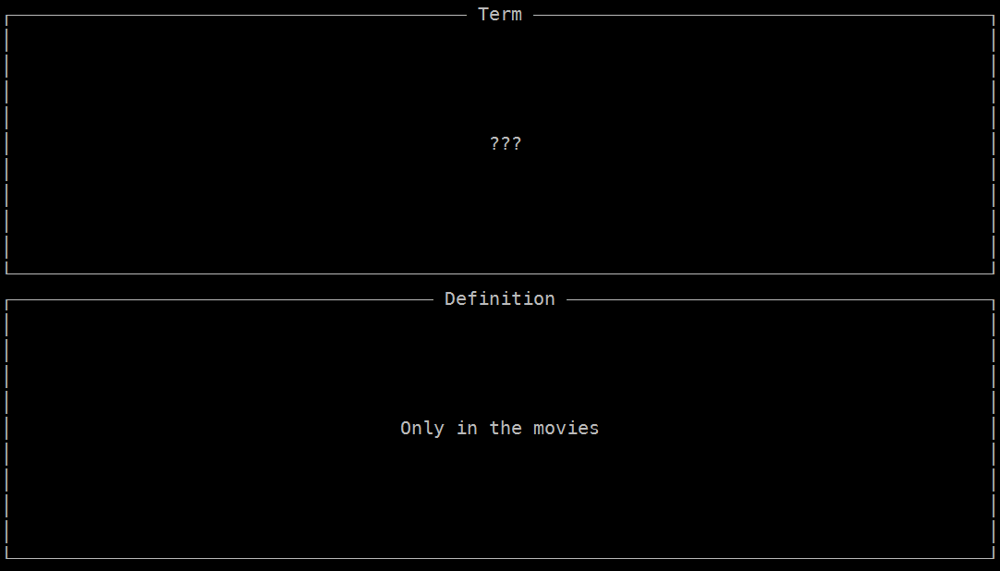

# flashcard

Super basic flashcard-esque script written in Python with urwid for the console based UI. Provide it with a CSV of your terms and definitions and just tap space to progress. Hitting 'Q' will quit.

Name | Description
---- | -----------
`-h --help` | Show help screen.
`<definitions>` | Use the provided CSV.

My first foray into using urwid, still don't entirely understand what's going on, but it's pretty cool nonetheless.
